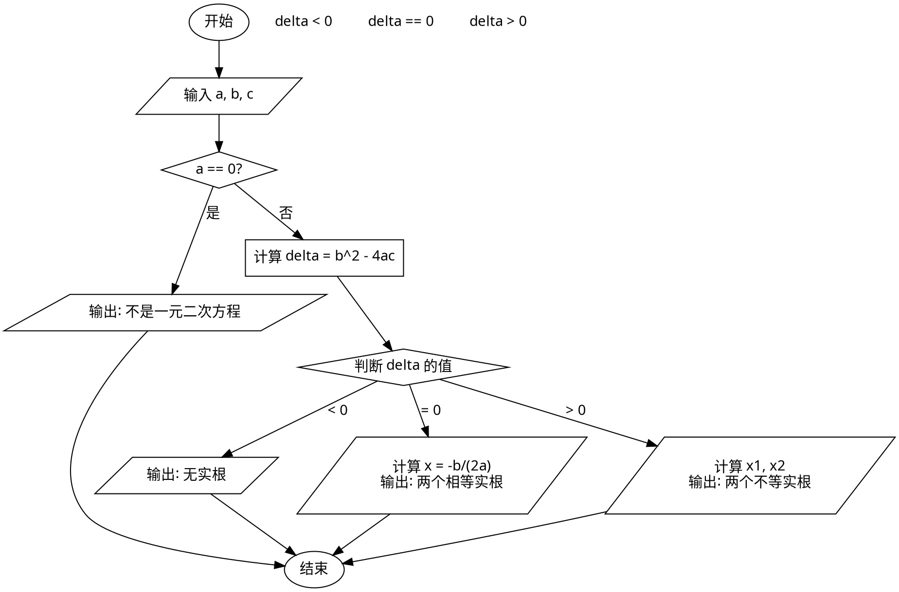
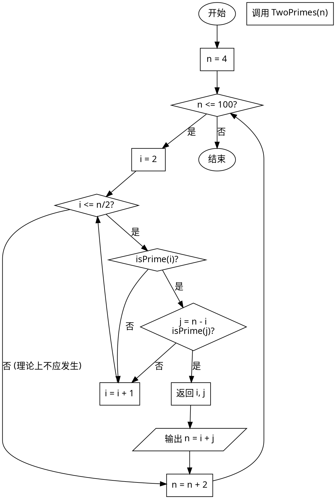

# 实验六 实验报告

## 三、实验内容
1. **一元二次方程求解**: 编写程序 `Solve.py`，定义函数求解方程根及判别式，根据用户输入的系数输出结果。
2. **哥德巴赫猜想验证**: 编写程序 `Goldbach.py`，验证 4~100 之间的偶数能否表示为两个素数之和。

## 四、实验步骤

### 1. IPO分析和流程图

#### (1) 一元二次方程求解 (Solve.py)

**IPO 分析:**
*   **输入 (Input):** 用户通过键盘输入三个系数 $a, b, c$（浮点数）。
*   **处理 (Process):**
    *   计算判别式 $\Delta = b^2 - 4ac$。
    *   判断 $a$ 是否为 0（非二次方程）。
    *   判断 $\Delta$ 的符号：
        *   $\Delta < 0$: 无实根。
        *   $\Delta = 0$: 两个相等实根 $x_1 = x_2 = -b / (2a)$。
        *   $\Delta > 0$: 两个不等实根 $x_{1,2} = (-b \pm \sqrt{\Delta}) / (2a)$。
*   **输出 (Output):** 方程的根或提示信息。

**流程图 (Graphviz DOT 源码):**


#### (2) 哥德巴赫猜想验证 (Goldbach.py)

**IPO 分析:**
*   **输入 (Input):** 设定范围 4 到 100。
*   **处理 (Process):**
    *   遍历范围内的每一个偶数 $n$。
    *   对于每个 $n$，寻找两个素数 $p_1, p_2$ 使得 $p_1 + p_2 = n$。
    *   `isPrime(x)` 函数判断素数。
    *   `TwoPrimes(n)` 函数寻找素数对。
*   **输出 (Output):** 打印验证等式，如 `24=5+19`。

**流程图 (Graphviz DOT 源码):**


### 2. 源程序和运行结果记录与截图

#### (1) Solve.py

**源代码:**
```python
import math

# 匿名函数计算判别式 delta = b^2 - 4ac
calc_delta = lambda a, b, c: b**2 - 4*a*c

def solve(a, b, c):
    """
    求解一元二次方程 ax^2 + bx + c = 0
    :param a: 二次项系数
    :param b: 一次项系数
    :param c: 常数项
    :return: (root1, root2) 或 (None, None)
    """
    delta = calc_delta(a, b, c)
    
    if delta < 0:
        return None, None
    elif delta == 0:
        x = -b / (2 * a)
        return x, x
    else:
        sqrt_delta = math.sqrt(delta)
        x1 = (-b + sqrt_delta) / (2 * a)
        x2 = (-b - sqrt_delta) / (2 * a)
        return x1, x2

if __name__ == "__main__":
    print("求解一元二次方程 ax^2 + bx + c = 0")
    try:
        user_input = input("请输入系数 a, b, c (用逗号分隔): ")
        # 处理可能包含空格的情况
        parts = user_input.replace('，', ',').split(',')
        if len(parts) != 3:
            raise ValueError("需要输入三个参数")
            
        a, b, c = map(float, parts)
        
        if a == 0:
            print("系数 a 不能为 0，这不是一元二次方程。")
        else:
            root1, root2 = solve(a, b, c)
            
            if root1 is None:
                print(f"方程 {a}x^2 + {b}x + {c} = 0 无实根")
            elif root1 == root2:
                print(f"方程 {a}x^2 + {b}x + {c} = 0 有两个相等的实根: x1 = x2 = {root1}")
            else:
                print(f"方程 {a}x^2 + {b}x + {c} = 0 有两个不相等的实根: x1 = {root1}, x2 = {root2}")
                
    except ValueError as e:
        print(f"输入错误: {e}。请确保输入三个数字并用逗号分隔。")
    except Exception as e:
        print(f"发生错误: {e}")
```

**运行结果:**
```text
求解一元二次方程 ax^2 + bx + c = 0
请输入系数 a, b, c (用逗号分隔): 1, -2, 1
方程 1.0x^2 + -2.0x + 1.0 = 0 有两个相等的实根: x1 = x2 = 1.0

求解一元二次方程 ax^2 + bx + c = 0
请输入系数 a, b, c (用逗号分隔): 1, -3, 2
方程 1.0x^2 + -3.0x + 2.0 = 0 有两个不相等的实根: x1 = 2.0, x2 = 1.0

求解一元二次方程 ax^2 + bx + c = 0
请输入系数 a, b, c (用逗号分隔): 1, 0, 1
方程 1.0x^2 + 0.0x + 1.0 = 0 无实根
```

#### (2) Goldbach.py

**源代码:**
```python
import math

def isPrime(n):
    """
    判断一个整数是否为素数
    :param n: 待判断整数
    :return: True if prime, False otherwise
    """
    if n <= 1:
        return False
    if n == 2:
        return True
    if n % 2 == 0:
        return False
        
    # 只需要判断到 sqrt(n)
    limit = int(math.sqrt(n)) + 1
    for i in range(3, limit, 2):
        if n % i == 0:
            return False
    return True

def TwoPrimes(n):
    """
    将偶数 n 拆分成两个素数之和
    :param n: 大于2的偶数
    :return: (prime1, prime2)
    """
    # 遍历从 2 到 n/2
    for i in range(2, n // 2 + 1):
        if isPrime(i):
            j = n - i
            if isPrime(j):
                return i, j
    return None, None

if __name__ == "__main__":
    print("验证哥德巴赫猜想 (4 ~ 100):")
    count = 0
    for num in range(4, 101, 2):
        p1, p2 = TwoPrimes(num)
        if p1 is not None:
            # 格式化输出，例如 24=5+19
            print(f"{num}={p1}+{p2}", end='\t')
            count += 1
            # 每行打印 5 个
            if count % 5 == 0:
                print()
        else:
            print(f"{num} 无法拆分为两个素数之和 (反例?)", end='\t')
    print("\n验证完成。")
```

**运行结果:**
```text
验证哥德巴赫猜想 (4 ~ 100):
4=2+2	6=3+3	8=3+5	10=3+7	12=5+7	
14=3+11	16=3+13	18=5+13	20=3+17	22=3+19	
24=5+19	26=3+23	28=5+23	30=7+23	32=3+29	
34=3+31	36=5+31	38=7+31	40=3+37	42=5+37	
44=3+41	46=3+43	48=5+43	50=3+47	52=5+47	
54=7+47	56=3+53	58=5+53	60=7+53	62=3+59	
64=3+61	66=5+61	68=7+61	70=3+67	72=5+67	
74=3+71	76=3+73	78=5+73	80=7+73	82=3+79	
84=5+79	86=3+83	88=5+83	90=7+83	92=3+89	
94=5+89	96=7+89	98=19+79	100=3+97	
验证完成。
```

## 五、实验结果及分析

1.  **一元二次方程求解**:
    *   程序成功实现了对不同判别式情况的处理。
    *   使用了 `lambda` 表达式简化了判别式的计算。
    *   增加了对输入格式的异常处理，防止用户输入非数字或格式错误导致程序崩溃。
    *   注意到了浮点数运算的精度问题，但在本实验范围内直接比较 `delta == 0` 是可行的。

2.  **哥德巴赫猜想验证**:
    *   程序成功验证了 4 到 100 之间的所有偶数均符合哥德巴赫猜想。
    *   `isPrime` 函数通过只遍历到 $\sqrt{n}$ 并跳过偶数，提高了素数判断的效率。
    *   `TwoPrimes` 函数只需遍历到 $n/2$，避免了重复计算（如 3+5 和 5+3）。

## 六、实验体会

通过本次实验，我深入理解了 Python 函数的定义与调用方法，掌握了 `lambda` 匿名函数的使用场景。在编写哥德巴赫猜想验证程序时，体会到了算法优化的重要性（如素数判断的优化）。同时，通过绘制流程图，锻炼了将逻辑思维转化为图形化表达的能力，有助于理清程序结构。
