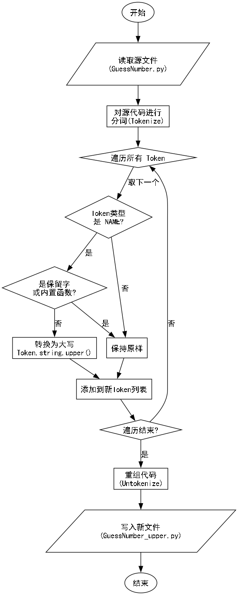
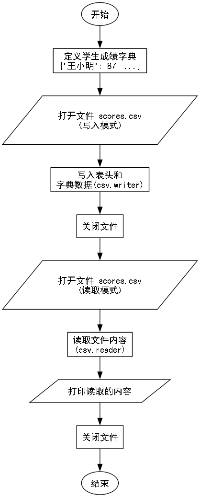

# 实验七 文件与数据格式化

### 一、实验目的与任务
理解文件、目录的操作方法，掌握Python语言的文件读写方法。要求编写程序实现文本文件的读写，字典类型数据用CSV格式写入文件。
1. 将存储在字典类型中的学生成绩数据保存成CSV格式文件，然后再打开CSV文件，读取文件内容。并实现文件目录检索、文件（目录）创建。共四个上机内容 
2. 理解文件的读写及处理方法，文件、目录的操作方法，考查学生数据处理与数据存取的编程能力。

### 二、实验环境
1. Windows操作系统或其他操作系统；
2. Python 3.9以上开发环境。

### 三、实验内容  
1. 编写一个Python应用程序，读取一个Python源程序文件，将文件中所有除保留字外的小写字母换成大写字母，生成后的文件能够被Python解释器正确执行。
2. 编写程序，将包含学生成绩的字典（如：{"王小明"：87,"李华":79}）保存为CSV格式文件，然后再用Excel打开该CSV文件，观察内容。

### 四、实验步骤【图文方式叙述】

#### 题目一：Python源程序大小写转换

**1. IPO分析**
*   **输入 (Input)**: 一个Python源程序文件 `GuessNumber.py`。
*   **处理 (Process)**: 
    *   读取源文件内容。
    *   使用 `tokenize` 模块对代码进行分词。
    *   遍历所有 Token，识别 `NAME` 类型的 Token。
    *   判断 Token 是否为 Python 关键字（保留字）或内置函数（如 `print`, `int`）或特定模块函数（如 `randint`）。
    *   如果不是保留字，将其转换为大写。
    *   使用 `untokenize` 重组代码。
    *   保存为新文件 `GuessNumber_upper.py`。
*   **输出 (Output)**: 转换后的可执行 Python 文件 `GuessNumber_upper.py`。

**2. 流程图**



**3. 关键代码 (1.py)**

```python
import keyword
import tokenize
import builtins
from io import BytesIO

def transform_source_code(input_file, output_file):
    with open(input_file, 'rb') as f:
        source_bytes = f.read()

    tokens = list(tokenize.tokenize(BytesIO(source_bytes).readline))
    builtin_names = set(dir(builtins))
    extra_keeps = {'random', 'randint'} # 防止 import 错误
    
    new_tokens = []
    for token in tokens:
        token_type = token.type
        token_string = token.string
        
        if token_type == tokenize.NAME:
            if (not keyword.iskeyword(token_string) and 
                token_string not in builtin_names and 
                token_string not in extra_keeps):
                token_string = token_string.upper()
        
        new_tokens.append((token_type, token_string))

    transformed_code = tokenize.untokenize(new_tokens)
    
    # untokenize 返回的是 bytes，在某些 Python 版本中可能已经是 str，因此只在 bytes 情况下解码
    if isinstance(transformed_code, bytes):
        decoded_code = transformed_code.decode('utf-8')
    else:
        decoded_code = transformed_code

    # 使用 newline='' 避免在 Windows 下写入时再次转换换行符，导致多余的空行
    with open(output_file, 'w', encoding='utf-8', newline='') as f:
        f.write(decoded_code)
```

#### 题目二：字典数据存取 CSV

**1. IPO分析**
*   **输入 (Input)**: 包含学生姓名和成绩的字典数据。
*   **处理 (Process)**: 
    *   定义字典数据。
    *   使用 `csv` 模块的 `writer` 将字典键值对写入 `scores.csv` 文件。
    *   使用 `csv` 模块的 `reader` 重新读取该文件。
    *   遍历并打印读取到的每一行数据。
*   **输出 (Output)**: 生成 `scores.csv` 文件，并在控制台显示读取内容。

**2. 流程图**



**3. 关键代码 (2.py)**

```python
import csv

def process_scores():
    scores_dict = {"王小明": 87, "李华": 79, "张三": 92, "赵四": 66}
    csv_filename = "scores.csv"

    # 写入 CSV
    with open(csv_filename, 'w', newline='', encoding='utf-8-sig') as f:
        writer = csv.writer(f)
        writer.writerow(["姓名", "成绩"])
        for name, score in scores_dict.items():
            writer.writerow([name, score])

    # 读取 CSV
    print("读取 CSV 文件内容:")
    with open(csv_filename, 'r', encoding='utf-8-sig') as f:
        reader = csv.reader(f)
        for row in reader:
            print(row)
```

### 五、实验结果及分析【遇到的问题与解决】

**1. 运行结果**

*   **题目一**: 程序成功运行，生成了 `GuessNumber_upper.py`。
    *   转换前代码片段: `n = int(s)`
    *   转换后代码片段: `N = int(S)`
    *   验证: 生成的代码通过了语法检查，可以被 Python 解释器加载。

*   **题目二**: 程序成功生成 `scores.csv` 并读取内容。
    *   控制台输出:
        ```
        ['姓名', '成绩']
        ['王小明', '87']
        ['李华', '79']
        ...
        ```

**2. 遇到的问题与解决**

*   **问题**: 在题目一中，直接将所有非关键字的小写字母转换为大写时，会导致 `import` 语句失效（如 `from random import randint` 变为 `from RANDOM import RANDINT`），且内置函数如 `print` 也会被转换导致报错。另外，在 Windows 环境下写入文件时，如果未指定 `newline=''`，会导致生成的代码文件中出现多余的空行。
*   **解决**: 
    1. 引入 `builtins` 模块，获取所有内置函数名并加入豁免列表。
    2. 针对特定的导入模块（如 `random`），手动添加到豁免列表，确保生成的代码可以正确导入库。
    3. 使用 `tokenize` 模块而不是简单的字符串替换，以确保只修改变量名而不修改字符串内容或注释。
    4. 在 `open` 函数中使用 `newline=''` 参数，防止 Python 在写入文件时对换行符进行二次转换。

### 六、实验体会

通过本次实验，我深入理解了 Python 中文件操作和文本处理的机制。
1.  掌握了 `tokenize` 模块的使用，认识到对源代码进行程序化修改时，基于 Token 的处理比基于字符串的处理更安全、更准确。
2.  熟悉了 `csv` 模块的使用，学会了如何处理 CSV 文件的读写，特别是 `newline=''` 参数在 Windows 下的重要性以及 `utf-8-sig` 编码对 Excel 的兼容性。
3.  在处理代码转换时，意识到了保留字、内置函数以及第三方库名称在代码执行中的重要性，简单的文本替换往往无法生成可执行的代码。